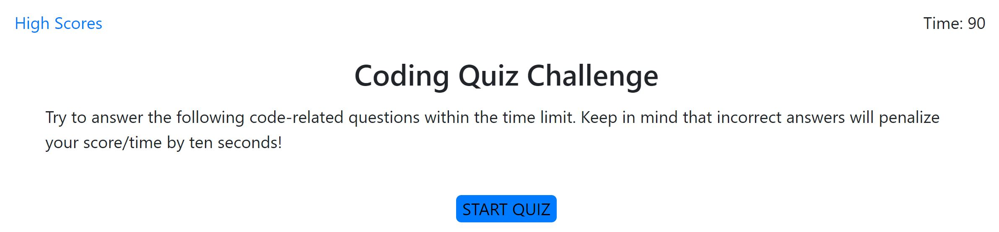

# codeQuiz

The purpose of this site is to provide a timed quiz on coding fundamentals that stores high scores.

## Getting Started / Prerequisites

The quiz consists of multiple choice answers. The user clicks a button to select and answer and receives 
a message stating that the answer is correct/incorrect. Once the timer reaches zero or all questions have been answered, the user is presented with a score and prompted to enter his/her initials.

No installation required.

## Authors

Matthew Grove

## License

N/A